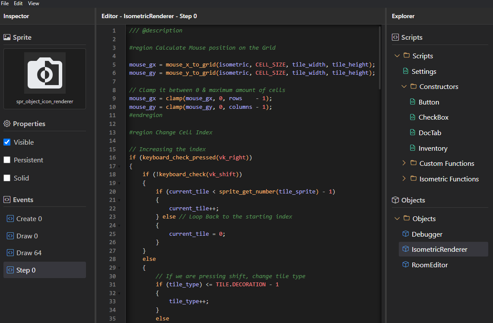

# GM Lite

A lightweight desktop IDE for **GameMaker Studio** projects, built with Electron. GM Lite focuses on fast project navigation and editing while providing useful GameMaker-aware tooling without the overhead of the full GameMaker IDE.



## Features

* **GameMaker project support** — Open existing GameMaker Studio projects by selecting a directory containing a `.yyp` project file.
* **Project explorer** — Automatically discovers scripts and objects from the GameMaker project structure.
* **Code editor** — Edit GML files with CodeMirror.
* **Syntax highlighting** — GameMaker-oriented language handling with editor support for JavaScript and XML.
* **Autocomplete** — Suggestions for GameMaker functions, built-ins, constants, assets, macros, enums, and common code snippets.
* **Search & replace** — Find, replace, and replace-all with case-sensitive, whole-word, and regular-expression options.
* **Code folding** — Fold code blocks and comments.
* **Object inspector** — Inspect and modify selected GameMaker object properties.
* **Sprite previews** — Display sprite information and previews when available.
* **Project state** — Remembers the most recently opened project.
* **GameMaker function database** — Includes `functions.xml` for GameMaker function and language data.
* **Cross-platform packaging** — Electron Builder configuration for Windows, macOS, and Linux.

## Why GM Lite?

GM Lite is a smaller, focused alternative for developers who mainly want to **browse, inspect, and edit GameMaker projects** without opening the full GameMaker environment.

It works directly with the files in a GameMaker project, allowing changes to scripts and selected object data to be written back to the project.

## Tech Stack

* [Electron](https://www.electronjs.org/)
* JavaScript
* HTML
* CSS
* [CodeMirror](https://codemirror.net/)
* Electron Builder
* GameMaker Studio 2 project files

## Getting Started

### Requirements

* [Node.js](https://nodejs.org/)
* A GameMaker Studio project

### Installation

```bash
git clone https://github.com/Zileriel/gm-lite.git
cd gm-lite
npm install
```

### Run

```bash
npm start
```

For development:

```bash
npm run dev
```

### Build

Create a distributable application with Electron Builder:

```bash
npm run build
```

Build output is placed in the `dist` directory.

## Usage

1. Launch GM Lite.
2. Choose **File → Open Project**.
3. Select the root directory of a GameMaker Studio 2 project.
4. GM Lite validates the directory by looking for a `.yyp` file.
5. Browse scripts and objects through the interface.
6. Select a script or object to inspect and edit it.
7. Save changes with **File → Save Project** or `Ctrl+S` / `Cmd+S`.

GM Lite also restores the last opened project when possible.

## Project Structure

```text
gm-lite/
├── functions.xml          # GameMaker language/function data
├── icon.png               # Application icon
├── image.png              # README preview image
├── package.json
└── src/
    ├── main/
    │   ├── main.js        # Electron main process
    │   └── preload.js     # Secure renderer bridge
    └── renderer/
        ├── index.html     # Application UI
        ├── scripts/
        │   └── renderer.js
        └── styles/
            └── main.css
```

## Keyboard Shortcuts

| Shortcut                       | Action         |
| ------------------------------ | -------------- |
| `Ctrl+O` / `Cmd+O`             | Open Project   |
| `Ctrl+S` / `Cmd+S`             | Save Project   |
| `Ctrl+Shift+L` / `Cmd+Shift+L` | Toggle Feather |

Standard editor shortcuts are also available through CodeMirror.

## Security

GM Lite uses Electron's preload architecture with:

* Node integration disabled in the renderer
* Context isolation enabled
* A dedicated preload bridge for renderer/main-process communication

## Status

GM Lite is an independent project and is not affiliated with or endorsed by **GameMaker** or **YoYo Games**.

## License

This project is currently distributed under the license specified in `package.json`.

---

Built by [Zileriel](https://github.com/Zileriel).
